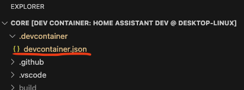
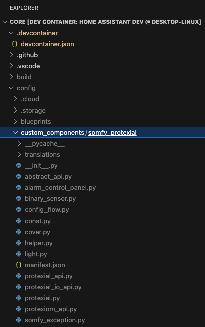

# Comment développer cette intégration

Pré-requis:
- Visual Studio Code
- Docker desktop

## Configurer l'environnement de développement HA dans VS Code
Visual Studio Code + devcontainer: https://developers.home-assistant.io/docs/development_environment#developing-with-visual-studio-code--devcontainer

## Fork + Clone le repository somfy-protexial en local
- Comme par exemple dans: `/Users/Vous/dev/somfy-protexial`

## Monter l'intégration dans le container de dev
- Dans VS Code localiser le fichier `.devcontainer/devcontainer.json`</br>

- Y ajouter le point de montage et re-construire le cotainer
```json
{
  "name": "Home Assistant Dev",
  ...
  "mounts": [
    "source=/Users/Vous/dev/somfy-protexial/custom_components/somfy_protexial,target=/workspaces/core/config/custom_components/somfy_protexial,type=bind,consistency=cached"
  ],
  ...
}
```
## Editer et debugger
- Les fichiers de l'intégration sont maintenant disponibles dnas le container


- L'intégration peut être débuggée directement comme le reste de HA
