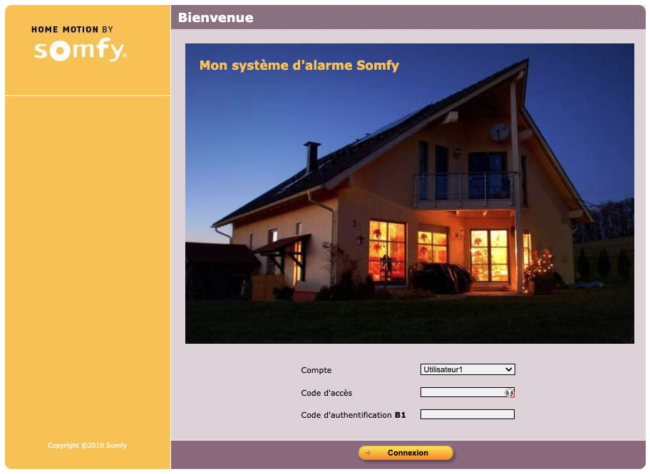
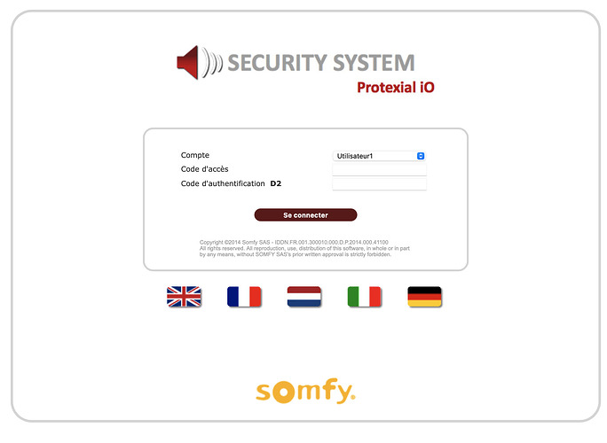
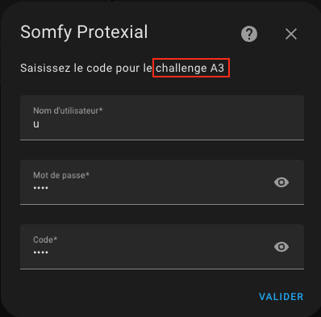
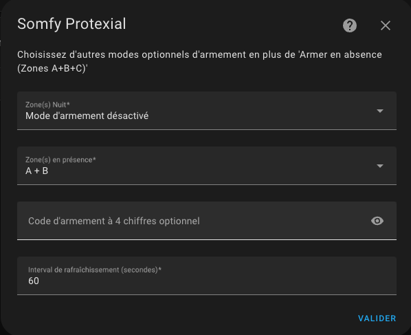

# Somfy Protexial / Protexiom / Protexial IO

[![GitHub Release][releases-shield]][releases]
[![License][license-shield]](LICENSE)

## Outros idiomas

[English](README.en.md) | [Deutsch](README.de.md) | [Español](README.es.md) | [Italiano](README.it.md) | [Nederlands](README.nl.md) | [Português](README.pt.md)

## Sobre

🔀 Esta versão 2.0.x é um **fork atualizado** da integração original de [the8tre](https://github.com/the8tre), disponível [aqui](https://github.com/the8tre/somfy-protexial).

Os principais objetivos desta integração são antecipar:

- o **fim da rede 2G**, fornecendo uma alternativa fiável sem necessidade de substituir todo o sistema de alarme, permitindo receber alertas de intrusão (ou de outros eventos) diretamente através do Home Assistant e da aplicação para smartphone, incluindo notificações críticas (ou seja, notificações que são apresentadas mesmo quando o telemóvel está em modo silencioso).
- o [**encerramento dos servidores Somfy Protexial/Protexiom**](https://forum.hacf.fr/t/integration-custom-centrale-somfy-protexial/23589/223), embora o impacto previsto seja muito reduzido.

Esta integração permite ligar centrais de alarme Somfy Protexial, Protexiom e Protexial IO ao Home Assistant.

### Modelos testados

| Modelo | Versão | Estado |
| -------------- | --------------- | ------------------ |
| Protexial IO | `2013 (v10_13)` | :white_check_mark: |
| Protexiom 5000 | `2013 (v10_3)` | :white_check_mark: |
| Protexial | `2013 (v10_13)` | :white_check_mark: |
| Protexial | `2013 (v10_14)` | :white_check_mark: |
| Protexial | `2013 (v10_15)` | :white_check_mark: |
| Protexial | `2010 (v7_9)` | :white_check_mark: |
| Protexial | `2010 (v8_1)` | :white_check_mark: |
| Protexial | `2008` | :white_check_mark: |

⚠️ O facto de um modelo não aparecer nesta lista **não significa** que não seja compatível. Apenas pode ainda não ter sido testado ou comunicado por outros utilizadores.

🔎 A integração permite visualizar o estado do sistema de alarme e de todos os dispositivos associados.

👉🏻 A integração permite controlar:

- 🚨 o alarme por zonas (A, B e C)
- 🪟 os estores
- 💡 as luzes

🔃 A integração também permite repor falhas de alarme, comunicação por rádio e baterias.

#### Entidades suportadas

| Entidade | Descrição | Versão |
| ----------------------------------- | ----------------------------------------------------------- |-----------------------------------------------------------|
| `alarm_control_panel.alarme` | Suporta os modos `armed_away`, `armed_home` e `armed_night` | 1.2.4 |
| `cover.volets` | Abrir, fechar e parar. O controlo de posição não é suportado. | 1.2.4 |
| `light.lumieres` | Ligar/desligar (o estado é mantido pela integração. Não é possível saber se as luzes foram ligadas ou desligadas através de um comando, interruptor ou outra integração). | 1.2.4 |
| `binary_sensor.batterie` | Estado agregado das baterias | 1.2.4 |
| `binary_sensor.boitier` | Estado da central | 1.2.4 |
| `binary_sensor.communication_radio` | Estado da comunicação por rádio | 1.2.4 |
| `binary_sensor.communication_gsm` | Estado da comunicação GSM | 1.2.4 |
| `binary_sensor.mouvement_detecte` | Estado da deteção de movimento | 1.2.4 |
| `binary_sensor.porte_ou_fenetre` | Estado de portas e janelas | 1.2.4 |
| `binary_sensor.camera` | Estado da ligação da câmara | 1.2.4 |
| `sensor.signal_gsm_5` | Intensidade do sinal GSM (/5) | 1.2.6 |
| `sensor.operateur_gsma` | Operador GSM | 1.2.6 |
| `sensor.alarme_derniere_sync` | Última sincronização com a central | 2.0.7 |

#### São criados os seguintes sensores binários para representar cada dispositivo do sistema de alarme, incluindo os respetivos atributos:

| Entidade | Descrição – Atributos | Versão |
| ----------------------------------- | -------------------------------------------------------------------------------------------------------- | --------|
| `binary_sensor.do_ouvt_xxx` | Contacto de porta - Atributos: bateria, comunicação com a central, erro, sabotagem, aberta/fechada, em pausa | 2.0.0 |
| `binary_sensor.do_vitre_ouvt_xxx` | Contacto de janela com deteção de quebra de vidro - Atributos: bateria, comunicação com a central, erro, sabotagem, aberta/fechada, em pausa | 2.0.0 |
| `binary_sensor.do_vitre_ouvt_xxx` | Detetor acústico de quebra de vidro - Atributos: bateria, comunicação com a central, erro, sabotagem, aberta/fechada, em pausa | 2.0.0 |
| `binary_sensor.do_gar_xxx` | Contacto da porta da garagem - Atributos: bateria, comunicação com a central, erro, sabotagem, aberta/fechada, em pausa | 2.0.0 |
| `binary_sensor.dm_image_mvt_xxx` | Detetor de movimento com captura de imagem - Atributos: bateria, comunicação com a central, erro, sabotagem, em pausa | 2.0.0 |
| `binary_sensor.dm_mvt_xxx` | Detetor de movimento - Atributos: bateria, comunicação com a central, erro, sabotagem, em pausa | 2.0.0 |
| `binary_sensor.tr_tel_xxx` | Central de alarme - Atributos: bateria, comunicação com a central, erro, sabotagem, em pausa | 2.0.0 |
| `binary_sensor.clavier_clv_xxx` | Teclado - Atributos: bateria, comunicação com a central, erro, sabotagem, em pausa | 2.0.0 |
| `binary_sensor.cl_lcd_clv_xxx` | Teclado LCD - Atributos: bateria, comunicação com a central, erro, sabotagem, em pausa | 2.0.0 |
| `binary_sensor.sir_ext_xxx` | Sirene exterior - Atributos: bateria, comunicação com a central, erro, sabotagem, em pausa | 2.0.0 |
| `binary_sensor.sir_int_xxx` | Sirene interior - Atributos: bateria, comunicação com a central, erro, sabotagem, em pausa | 2.0.0 |
| `binary_sensor.d_fumee_fumee_xxx` | Detetor de fumo - Atributos: bateria, comunicação com a central, erro, em pausa | 2.0.0 |
| `binary_sensor.tc_multi_tlcmd_xxx` | Comando multicanal - Atributos: comunicação com a central, em pausa | 2.0.0 |
| `binary_sensor.tc_4_tlcmd_xxx` | Comando para múltiplas zonas - Atributos: comunicação com a central, em pausa | 2.0.0 |
| `binary_sensor.badge_bdg_axxx` | Identificador RFID - Atributos: comunicação com a central, em pausa | 2.0.0 |

Os atributos podem ser consultados no menu **"Detalhes"**.

#### Botões suportados

| Entidade | Descrição | Versão |
| ----------------------------------- | ----------------------------------------------------------- |-----------------------------------------------------------|
| `button.reinitialiser_defaut_alarme` | Repor falhas de alarme (movimento, abertura e sabotagem) | 2.0.7 |
| `button.reinitialiser_defaut_liaison_radio` | Repor falhas de comunicação por rádio entre a central e os sensores | 2.0.7 |
| `button.reinitialiser_defaut_piles` | Repor falhas das baterias | 2.0.7 |

## Instalação

### Opção A: Instalação através do HACS (recomendada)

1. Adicione este repositório GitHub ao HACS.
   - Automaticamente:   
   - Manualmente:
      - HACS → Integrações → Menu "..." → Repositórios personalizados
      - Repositório: `https://github.com/AuroreVgn/somfy-protexial`
      - Categoria: `Integração`
3. Transfira a integração.
   - HACS → Integrações → Somfy Protexial → Transferir
4. Reinicie o Home Assistant.

### Opção B: Instalação manual

1. Transfira o arquivo da versão mais recente: [somfy_protexial.zip](https://github.com/AuroreVgn/somfy-protexial/archive/refs/tags/2.0.11.zip)
2. Localize a pasta que contém o ficheiro `configuration.yaml` da sua instalação do Home Assistant.
3. Se a pasta `custom_components` não existir, crie-a.
4. Crie uma pasta `somfy_protexial` dentro de `custom_components`.
5. Extraia o conteúdo de `somfy_protexial.zip` para a pasta `somfy_protexial`.
6. Reinicie o Home Assistant.

## Configuração

- Adicione a integração utilizando  ou manualmente.
- Definições → Dispositivos e serviços → + Adicionar integração → Somfy Protexial

### 1. Endereço da central

- Introduza o URL da interface web local da sua central:
  `http://192.168.1.234` ou `http://192.168.1.234:9876`

 

### 2. Credenciais do utilizador

- Utilizador: `"u"` (**mantenha o valor pré-preenchido**)
- Palavra-passe: introduza a palavra-passe habitualmente utilizada.
- Código de autenticação: introduza o código do cartão de autenticação correspondente ao desafio apresentado.

### 3. Configuração adicional

Os diferentes modos de ativação utilizam as zonas configuradas na central Somfy:

- Ativação em ausência (sempre disponível): zonas A+B+C
- Ativação noturna (opcional): qualquer combinação de A, B, C, A+B, B+C ou A+C
- Ativação em casa (opcional): qualquer combinação de A, B, C, A+B, B+C ou A+C

**Código de ativação/desativação**

Se definir um código, este será solicitado sempre que ativar ou desativar o sistema de alarme.

**Intervalo de atualização**

De **15 segundos** até **1 hora**. O valor predefinido é **60 segundos**.

Não é recomendado utilizar um intervalo inferior, pois a interface web da central poderá tornar-se instável.

## Notas

### Cartão Lovelace para Home Assistant (estado e controlo)

Foi desenvolvido um [cartão Lovelace](https://github.com/developpeurbox/somfy-protexial-card) especificamente para esta integração.

### Cartão Mushroom Template (detalhes dos dispositivos)

Está disponível [aqui](https://github.com/AuroreVgn/somfy-protexial/blob/main/assets/Template%20Home%20Assistant) um modelo para o Home Assistant que apresenta cada dispositivo do sistema de alarme com os respetivos atributos (bateria, comunicação, etc.).

### Compatibilidade de versões

A lista de compatibilidade apresentada no início desta página **não é exaustiva**. É muito provável que esta integração seja compatível com outras versões das centrais Somfy. Se testar outra versão com sucesso, agradeço que me informe.

O ano ou a geração da interface web da sua central é apresentado na parte inferior das páginas:

Algumas centrais disponibilizam igualmente a versão do firmware através do seguinte URL:

*http://192.168.1.234/cfg/vers*

ou

*http://192.168.1.234:9876/cfg/vers*

### Utilização da interface web original

⚠️ **A central suporta apenas uma sessão de utilizador ativa de cada vez. Se pretender utilizar a interface web original, deverá desativar temporariamente esta integração.**

### Utilização da aplicação móvel original

⚠️ A aplicação oficial **Somfy Alarme** continua a poder ser utilizada mesmo com esta integração ativa.

### Reconfiguração da integração

A integração suporta a reconfiguração completa diretamente através da interface gráfica do Home Assistant.

## As contribuições são bem-vindas!

Se pretender contribuir para o projeto, consulte as [Contribution guidelines](CONTRIBUTING.md).

## Créditos

Esta integração baseia-se principalmente no trabalho de [@Ludeeus](https://github.com/ludeeus) e no projeto [integration_blueprint][integration_blueprint].

---

[integration_blueprint]: https://github.com/custom-components/integration_blueprint
[hacs]: https://hacs.xyz
[hacsbadge]: https://img.shields.io/badge/HACS-Custom-orange.svg?style=flat-square
[license-shield]: https://img.shields.io/github/license/the8tre/somfy-protexial.svg?style=flat-square
[maintenance-shield]: https://img.shields.io/badge/maintainer-%40the8tre-blue.svg?style=flat-square
[releases-shield]: https://img.shields.io/github/v/release/AuroreVgn/somfy-protexial.svg?style=flat-square
[releases]: https://github.com/AuroreVgn/somfy-protexial/releases
[user_profile]: https://github.com/AuroreVgn
